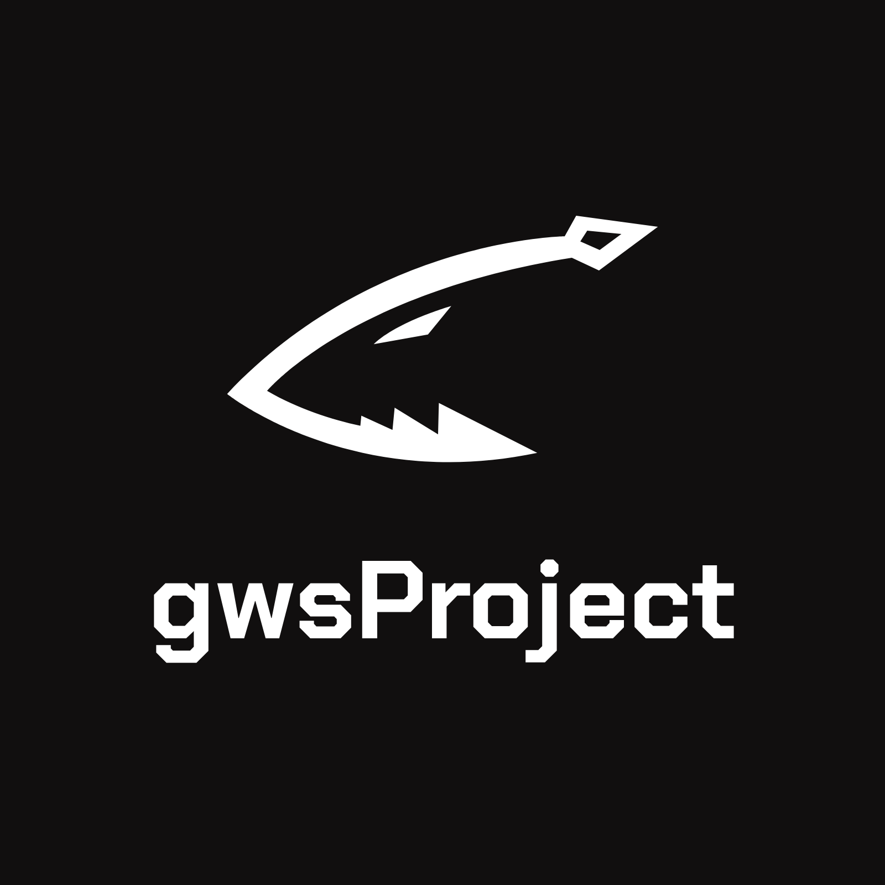
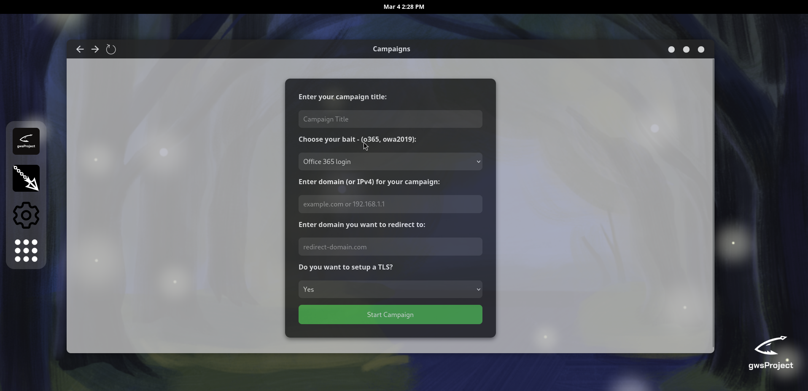
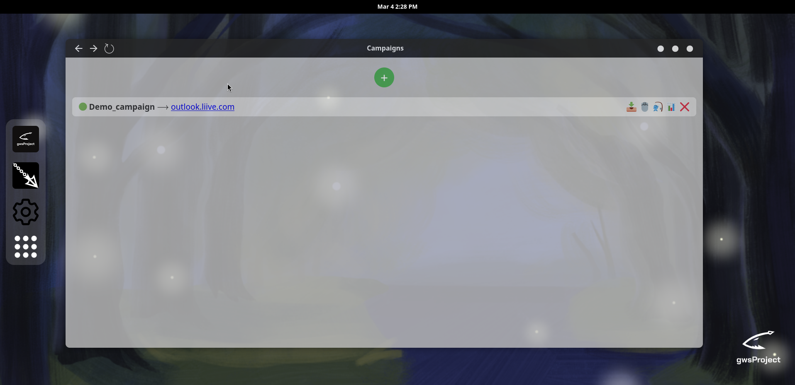
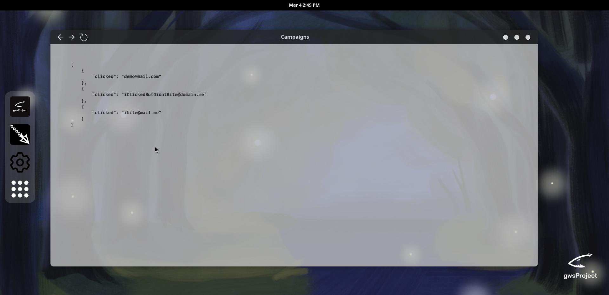
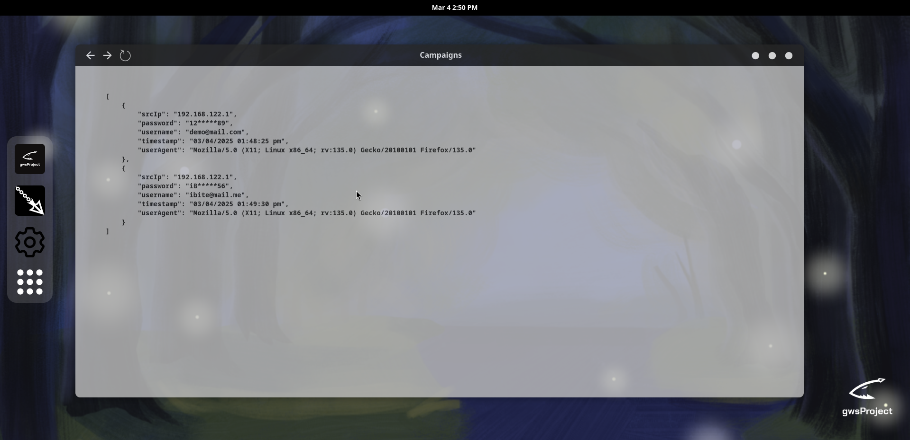
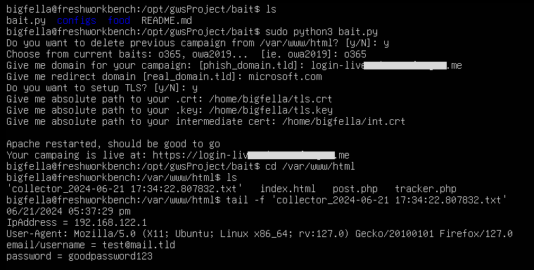
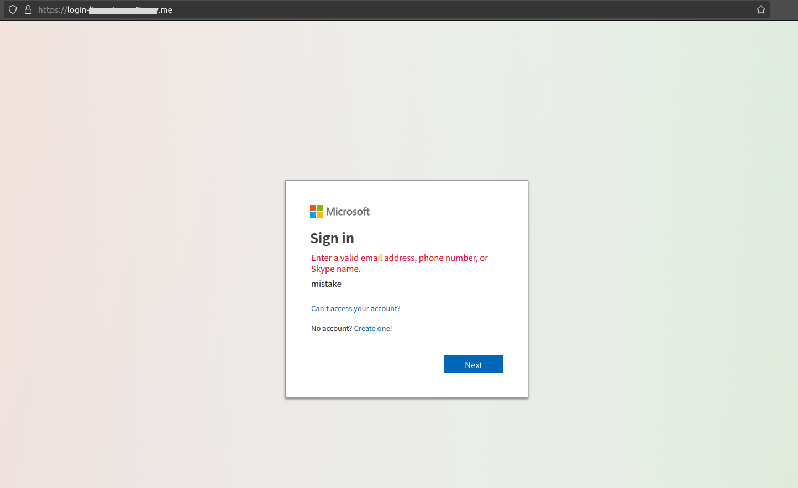
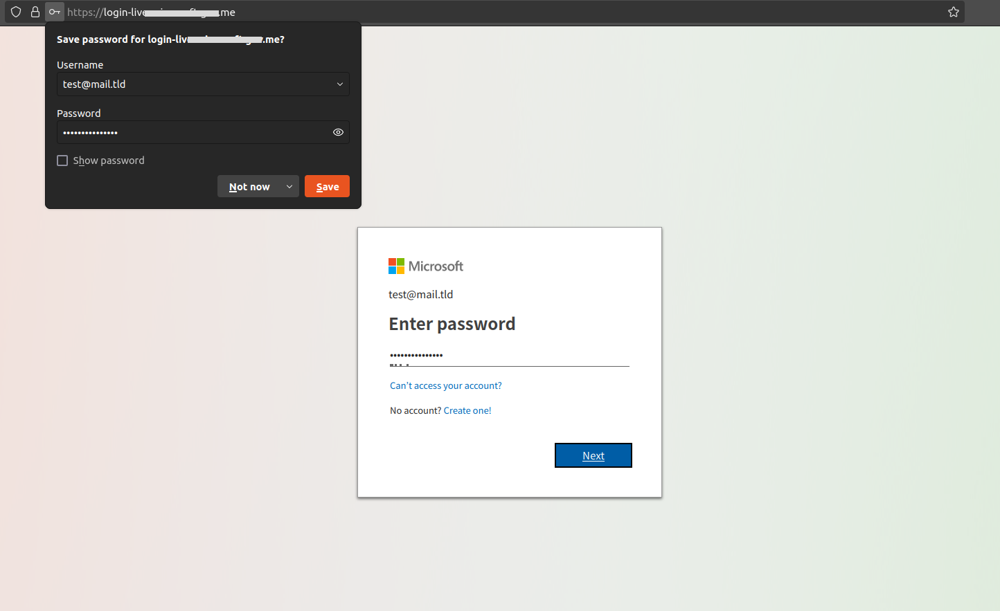

<h1 align="center">Great White Shark</h3>
<h3 align="center">Author: <a href="https://nikolazivkovic.me">bigfella</a></h3>

<p align="center">

</p>
<p align="center">Automated toolkit for conducting phishing campaigns</p>


## Bait
- Used for setting up web server with chosen template. 


## GUI

<p align="center">

</p>
<br>
<p align="center">

</p>
<br>
<p align="center">

</p>
<br>
<p align="center">

</p>


### CLI usage:
- When you are ready to serve your bait:
```
sudo python3 bait.py
```
- If you don't want to run it as super user, just deal with /var/www/* and /etc/apache2's ownerships.

### If you want to include custom templates
- Just place your template inside 'food' directory, and when asked too choose template - insert the name of your template.
- Make sure to also include post.php and tracker.php inside your templates root folder.

### Demo (last tested on 21/June/2024 - 24.04 Ubuntu server)

<p align="center">

</p>
<br>
<p align="center">

</p>
<br>
<p align="center">

</p>

