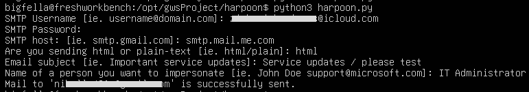
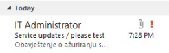
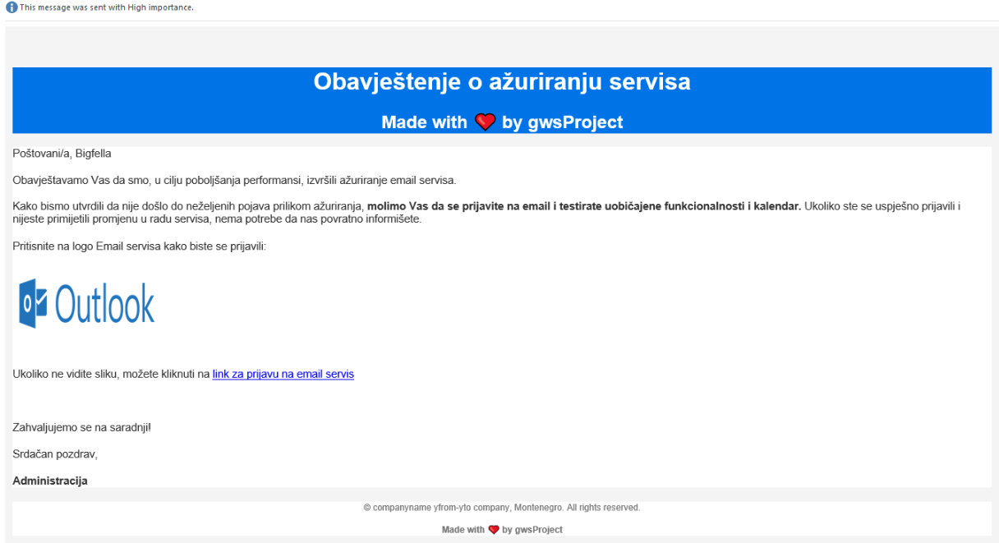

<h1 align="center">Great White Shark</h3>
<h3 align="center">Author: <a href="https://nikolazivkovic.me">bigfella</a></h3>

<p align="center">

</p>
<p align="center">Automated toolkit for conducting phishing campaigns</p>


## Harpoon
- Used for sending customized, either html or plain text mass emails (with high alert, personalization and sender spoofing options.

### Harpoon customization/usage:
Inside <b>assets</b> directory there are:
- mycontacts.txt
- html.txt
- plain.txt

Edit <b>mycontacts.txt</b> in format: (name email)
Paste html message you want to send inside  <b>html.txt</b>
Paste plain-text message you want to send inside <b>plain.txt</b>

### Ready, set, harpooon.
When you are ready to send your emails:
```
python3 harpoon.py
```

### Demo (last tested on 21/June/2024 - 24.04 Ubuntu server) 

<p align="center">

</p>
<br>
<p align="center">

</p>
<br>
<p align="center">

</p>
